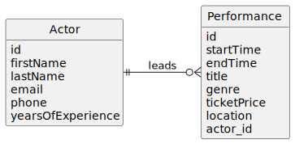

# Re-Exam Spring 2025 - Theater Booking System

### PDF Version

[Theater performance application - pdf](./spring2025-re.pdf)

## Exercise Guidelines

- The solution for this exam should primarily be solved with the technologies you have learned in the course. That means within the [course materials on this website](https://dat3cph.github.io/spring2025/). Core technologies are Java, Javalin, JPA, Hibernate, Postgres, and REST. Other frameworks such as Spring Boot, Spring Data, or Spring Security are not allowed.
- Allowed resources: written materials, personal computers, laptops, extra monitors, and internet resources. Headphones, and listening to music.
- Prohibited: communication with anyone. So no use of social media, forums, emails, SMS, chatrooms, etc.
- Do not store solutions on external networks or drives/hosts like Facebook, OneDrive, Google Drive, etc. And don't share your code on Github until the end of the exam.
- Duration: 5 hours.

## Consider your problem-solving strategy (important)

1. Read the entire exercise before starting.
2. Sometimes you need to interpret the tasks. If you are unsure, make a decision and document it by adding a comment in the code or the `README.md` file.
3. If you get stuck on a task, move on to the next one.
4. Focus on demonstrating your approach to solving the tasks.
5. You will be asked to create entities and JPA DAOs from the beginning. If you get totally stuck with JPA, and that makes it difficult to continue, you can create a mock DAO instead. The mock DAO should implement the same interface as the JPA DAO and have the data hardcoded in a class using a list or map. However, if most of your JPA code is working, you should continue with JPA. Most likely, you will not need to implement a mock DAO today. Consider it the last resort.

## Percentage distribution of the tasks

| Task  | Topic                                               | %  |
|-------|-----------------------------------------------------|----|
| 1     | JPA and DAOs                                        | 25 |
| 2     | Building a REST Service Provider with Javalin        | 25 |
| 3     | REST Error Handling                                  | 5  |
| 4     | Streams and Queries                                  | 10 |
| 5     | Getting additional data from API                    | 15 |
| 6     | Testing REST Endpoints                               | 15 |
| 7     | Security                                             | 5  |
|       | **Total**                                           | **100%** |

## Hand in on Wiseflow

- Set aside 10 minutes at the end of the exam to hand in your solution on Wiseflow in two versions:

1. A zip file containing your whole project, including the `README.md` file with answers to the theoretical questions.
2. A link to your GitHub repository. Don't push your solutions until the very end of the exam. Do not copy the clone link from GitHub, but grab the link from the browser address bar and paste it into a document and upload to Wiseflow as well.

---

## Introduction

Build a backend system for an event platform offering theater performances. The platform should manage actor profiles and the performances they lead.

---

## Domain Description

The application facilitates part of a booking system of theater performances with these properties:

1. **Performance**: `startTime`, `endTime`, `location` (`longitude`, `latitude`), `title`, `ticketPrice`, `id`, and `genre`. Genres are `drama`, `comedy`, `musical`.
2. **Actor**: `firstName`, `lastName`, `email`, `phone`, `yearsOfExperience`. An actor can lead multiple performances, but each performance has only one lead actor.

Note: For the sake of simplicity, we will not consider the ticket booking process in this exam. The focus is on managing performances and leading actors. Also, in in real life, one performance would also have multiple actors, but for this exam, we will only consider one lead actor per performance.



---

## Task 1: Setup

1.1 Create a new Java Project for Javalin and JPA.

1.2 Document your work in a `README.md` file.

---

## Task 2: JPA and DAOs (25%)

2.1 Establish a **HibernateConfig** class with a method that returns an **EntityManagerFactory**.

2.2 Implement a **Performance** entity class with the following properties: `startTime`, `endTime`, `location` (`latitude`, `longitude`), `title`, `ticketPrice`, `id`, `genre`. Use an enum for the genre of the performance. The enum should contain the values `drama`, `comedy`, and `musical`.

2.3 Implement an **Actor** entity class with the following properties: `firstName`, `lastName`, `email`, `phone`, `yearsOfExperience`, and a **OneToMany** relationship to performances.

2.4 Implement the DAOs for **Performance** and **Actor**.

2.4.1 Implement a **PerformanceDTO** and a **ActorDTO** class. Use an enum for the genre of the performance as in the entity class.

2.4.2 Create a generic Interface **IDAO** with CRUD operations (create, getAll, getById, update, delete), that uses DTOs as arguments and return types.

2.4.3 Create 2 new DAO classes **PerformanceDAO** and **ActorDAO** using JPA and Hibernate. The new DAO classes should implement the **IDAO** interface. You will need to implement the CRUD operations for **PerformanceDAO**, but you should only implement the CRUD operations for **ActorDAO** that you need for this exercise. So wait and see what you need.

2.4.4 Let the **PerformanceDAO** also implement another interface: **IPerformanceActorDAO** with these additional methods:

- `void addActorToPerformance(int performanceId, int actorId)`
- `Set<PerformanceDTO> getPerformancesByActor(int actorId)`

2.5 Create a **Populator** class and populate the database with performances and their lead actors.

---

## Task 3: Building a REST Service Provider with Javalin (25%)

3.1 Develop a REST API with Javalin for performances.

3.2 Create a **PerformanceController** that uses the **PerformanceDAO** to persist data in the database.

3.3 Create a **PerformanceRoutes** file that uses the **PerformanceController** to handle the API requests.

3.3.1 Implement routes in **PerformanceRoutes** file to handle the API requests. The routes should match the controller methods. That would be something like this:

| Method | Route                                          | Description                                  |
|--------|------------------------------------------------|----------------------------------------------|
| GET    | /performances                                  | Get all performances.                        |
| GET    | /performances/{id}                             | Get a performance by its id.                 |
| POST   | /performances                                  | Create a new performance. Add actor later.   |
| PUT    | /performances/{id}                             | Update information about a performance.      |
| DELETE | /performances/{id}                             | Delete a performance.                        |
| PUT    | /performances/{performanceId}/actors/{actorId} | Add an existing actor to an existing performance. |
| POST   | /performances/populate                         | Populate the database with performances and actors. |

3.3.2 Test the endpoints using a **dev.http** file. Document the output in your `README.md` file to verify the functionality.

3.3.3 As a minimum you should request all endpoints once to get all performances, get a performance by id, adding a performance, updating a performance, and deleting a performance. Also add an actor to a performance. For each request, document the response in your `README.md` file by copying the response.

3.3.4 When getting a performance by id, the response should include the actor information.

3.3.5 Theoretical question: Why do we suggest a PUT method for adding an actor to a performance instead of a POST method? It would also be an option to use the PATCH method. What is the difference between PUT and PATCH - and which http method would be the most correct for this request? Write the answer in your `README.md` file.

---

## Task 4: REST Error Handling (5%)

4.1 Return exceptions as JSON. At least for:

- Getting a performance by id, if the performance does not exist.
- Deleting a performance that does not exist.

Feel free to add more error handling as needed.

4.2 Explain the difference between a checked and an unchecked exception in Java. Which ones did you use in 4.1? Write the answers in your `README.md` file.

---

## Task 5: Streams and Queries (10%)

Feel free to use the Java Stream API and/or JPQL queries to solve the tasks below:

5.1 Create a method in **PerformanceController** to filter performances by genre, and add a new route to the **PerformanceRoutes** file to handle the request.

5.2 In a similar manner, find a way to get an overview with each actor.

- Choose between these two outputs:

1. The total sum price of all performances led by each actor. Like this:

    ```json
    [
    {
        "actorId": 1,
        "totalRevenue": 1000
    },
    {
        "actorId": 2,
        "totalRevenue": 2000
    }
    ]
    ```

    or  

2. The sum of performance time for each actor. Like this:

    ```json
    [
    {
        "actorId": 1,
        "totalTime": 120
    },
    {
        "actorId": 2,
        "totalTime": 240
    }
    ]
    ```

    5.3 Theoretical question: When would you use a stream instead of a query? Write the answer in your `README.md` file.

---

## Task 6: Getting Additional Data from API (15%)

6.1 Depending on the performance genre, get **props data** from an external API.

6.1.1 The external API is available at `https://exam.showcode.dk/api/performance/props/genre/{genre}`. For example, to get props for the genre `drama`, you would call [https://exam.showcode.dk/api/performance/props/genre/drama](https://exam.showcode.dk/api/performance/props/genre/drama).

6.1.2 The available genres are `drama`, `comedy`, and `musical`.

6.1.3 The API returns a JSON object with a list of suggested props for each genre in the following format:

```json
[
    {
        "name": "Cane",
        "description": "Used for dramatic entrances and exits.",
        "genre": "drama",
        "costEstimate": 200,
        "createdAt": "2024-10-30T17:44:58.547Z",
        "updatedAt": "2024-10-30T17:44:58.547Z"
    },
    {
        "name": "Old Letter",
        "description": "A weathered letter prop for pivotal emotional scenes.",
        "genre": "drama",
        "costEstimate": 30,
        "createdAt": "2024-10-30T17:44:58.547Z",
        "updatedAt": "2024-10-30T17:44:58.547Z"
    },
    {
        "name": "Antique Chair",
        "description": "Adds authenticity to a dramatic period setting.",
        "genre": "drama",
        "costEstimate": 150,
        "createdAt": "2024-10-30T17:44:58.547Z",
        "updatedAt": "2024-10-30T17:44:58.547Z"
    }
]
```

6.2 Implement a method in the **PerformanceController** that fetches props based on the genre of a performance. The method should return a list of props relevant to the genre.

6.3 Add the list of props to the response of the endpoint for **getting a performance by id**.

6.4 Add a new endpoint to get an **overview of the total cost estimate of props** for a performance based on its genre.

---

## Task 7: Testing REST Endpoints (15%)

7.1 Create a test class for the REST endpoints in your **PerformanceRoutes** file.

7.2 Set up `@BeforeAll` to create the Javalin server, the **PerformanceController**, **PerformanceRoutes**, and the **EntityManagerFactory** for testing.

7.3 Configure the `@BeforeEach` methods to create the test objects (Performances and Actors).

7.4 Create a test method for each of the endpoints.

7.5 Test the "performance by id" endpoint to verify that the instruction items are returned.

---

## Task 8: Security (5%)

8.1 Implement an authentication mechanism for the REST API using JWT (with login and protected endpoints).

8.2 Add allowed roles for each endpoint (make sure everyone can use at least the login endpoint).

8.3 Make creating, updating and deleting performances require a role of `admin`.

8.4 Adding security roles to the endpoints will make the corresponding Rest Assured Test fail. Now the request will return a 401 Unauthorized response. Describe how you would fix the failing tests in your README.md file, or if time permits, implement the solution so your tests pass.
