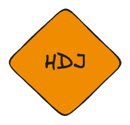

# Jons Her-Dumper-Jegliste

Følgende er en liste over vigtige ting, som jeg gennem årene har erfaret at studerende enten glemmer eller ikke har styr på, når de skal til eksamen. Listen er ikke udtømmende,

## JPA

1. Husk at annotere dine klasser med `@Entity` og `@Id` på dine primære nøgler.
2. Husk at indsætte dine entitetklasser i `HibernateConfig`-klassen.
3. Husk at annotere dine relationer med `@OneToMany`, `@ManyToOne`, `@OneToOne` og `@ManyToMany`.
4. Husk at undgå cirkulære referencer i dine klasser.
5. Husk at lave hjælpemetoder til at indsætte bi-directionelle relationer.
6. Husk at bruge `CascadeType` i dine relationer - og brug det med omtanke. Dvs, at du ikke nødvendigvis skal bruge `CascadeType.ALL`.
