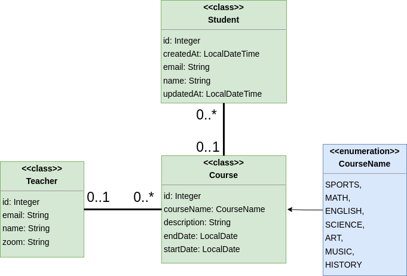

# JPA part II - CodeLab Exercise

This CodeLab exercise is designed to help you practice the concepts you have learned on the first day of JPA part 2. You will be working on a series of tasks that involve Java Persistence API, with Entities and DAOs. We will also practice [pair programming](../../toolbox/sys/projectmanagement/pairprogramming.md) and using Git and GitHub for version control.

## Exercise Overview

## Instructions

### 1. Team up (2 x 2)

### 2. Remember to mark your attendance in Moodle (for getting study points)

### 3. Set up the development environment (one per team of 2 x 2)

1. Create a new Maven project getting ready for JPA with Hibernate. Use the [JPA setup in IntelliJ](../../toolbox/java/orm/jpa_setup.md) guide to help you - or use your own starter project / template.
2. Make sure your `.gitignore` file is set up correctly and then initialize a new Git repository in your project folder. Add and commit your files.
3. Create a new branch: `develop`.
4. Create a new repository on GitHub, link them up, and push your project to the repository.
5. Every team member should clone the new repository to their local machine
6. Checkout the develop branch (each member).

### 3. Connecting to the database

1. Each member should create a database in your docker environment with postgres called `university`.
2. Set up `config.properties` with the database name, so Hibernate can connect to the database.

### 4. The assignment

You are going to create a simple application for a university. The application should be able to manage students, courses and teachers. This time around we are going to add relationships between the entities. The relationships can be seen in the class diagram above.
You need to implement the entities and DAO methods. Make sure to use the correct annotations for the relationships and try to understand how the relationships work.

**Remember to write integration tests for the DAO classes.**

Ask yourself the following questions before you start implementing the relationships:

- What are the relationship between the entities?
- Which one should be the owning side of the relationship and what does that mean?
- Should the relationship be unidirectional or bidirectional?
- What cascade type should be used or should we use them at all? What are the implications?
- Should we use fetch type eager or lazy and why?

### 5. Identify tasks, break them down in small steps

The following tasks are suggestions. You can add more tasks as you go along.

1. Create an **Enum** for the Course class as shown in the diagram and add the correct annotations to the Course class.
2. Create a **Teacher** entity class as shown in the diagram.
3. Create a **Student** entity class as shown in the diagram.
4. Create a **Course** entity class as shown in the diagram.
5. Add the relations between the entities as shown in the diagram.
      - a) student can attend many courses
      - b) a course can have many students
      - c) course can have only one teacher
      - d) a teacher can teach many courses
6. Create a generic DAO interface with CRUD methods. Call it `IDAO`.
7. Implement a CourseDAO class that implements the `IDAO` interface.
8. Implement a TeacherDAO class that implements the `IDAO` interface.
9. Implement a StudentDAO class that implements the `IDAO` interface.

10. Implement some integration tests for the DAO classes.
11. Implement some JPQL queries to get data from the database. Be creative and try to get data from the database in different ways:

      - a) Get all students that are attending a specific course
      - b) Get all courses that a specific student is attending
      - c) Get all courses that a specific teacher is teaching
      - d) Get all students that are attending a course that a specific teacher is teaching

### 6. Start working on the tasks (round 1)

1. Create a branch off the `develop` branch for each task
2. Work on the tasks in pairs

### 7. Reviewing and merging the feature branch

1. When you tiny team is happy with the implementation of the feature, merge the feature branch into the `develop` branch and push it to the repository and Github.

### 8. Repeat

1. Identify the next tasks
2. Repeat steps 6-7 for the next tasks
