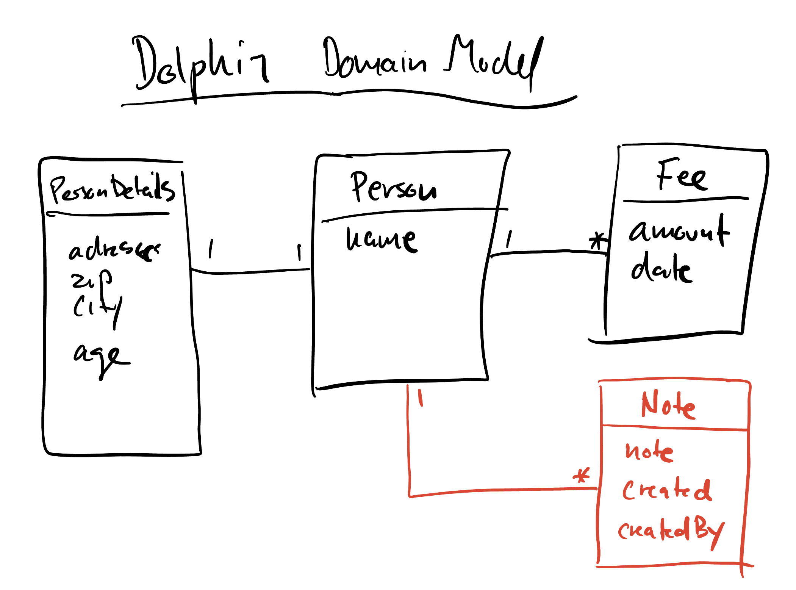

# Dolphin exercise (1:1 and 1:m relations)

## Before we begin

This exercise begins where the tutorial on JPA relations 1:1 and 1:m ends.

- [Video tutorial](https://cphbusiness.cloud.panopto.eu/Panopto/Pages/Sessions/List.aspx?folderID=6c569295-f604-4241-89e8-b06900ed8d21)
- [Source code for this exercise](https://github.com/jonbertelsen/dolphin_spring2025). This one can be cloned if you haven't done your own coding along with the tutorial.

## Next step: adding to the data model

The Domain model below shows the entities from the tutorial. Those are sketched in black ink (`Person`, `PersonDetail`, and `Fee`). Now the board of the Dolphin swim-club have asked for an extra use case:

>US-1: As a administrator I would like to be able to add notes to each person, so we can keep track of important information. Each note contains a brief text, the date of creation, and the person who entered the note.

The new user story is added to the domain model in red.

### Todo (add functionality and refactor)

1. Please consider how to implement US-1 - and do it.
2. Add a few notes to each person.
3. Create a DolphinDAO and implement basic CRUD operations. At least enough to persist some test data.
4. Write Unit tests to make sure that everything works.

Now the board wants more:

>US-2: As an administrator I would like to be able to get the total amount paid for a given person.

>US-3: As an administrator I would like to be able to get a list of all notes for a given person

### Todo (add queries)

1. Implement US-2
2. Implement US-3

Make us proud ;-)

Now we got the full attention of the board - and they want more:

>US-4: As an administrator I would like to get a list of all notes with the name and age of the person it belongs to.

### Todo (add query and print out table)

1. Implement US-4. Hint: you might want to use what is called a [DTO projection](https://thorben-janssen.com/dto-projections/) to make handling query output easier.
