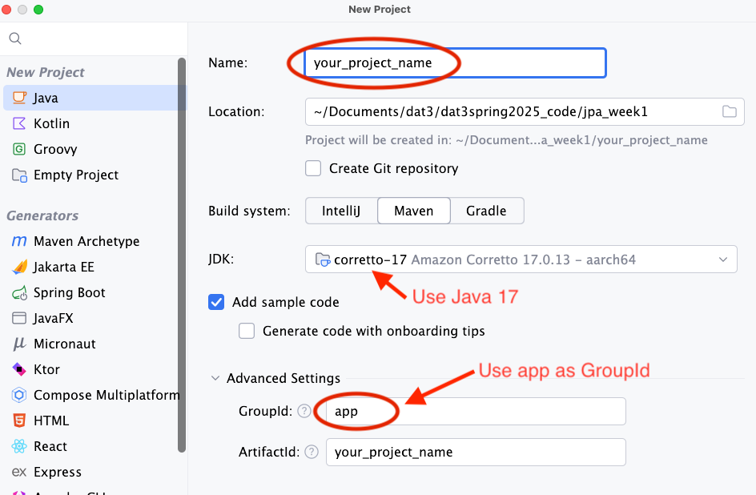
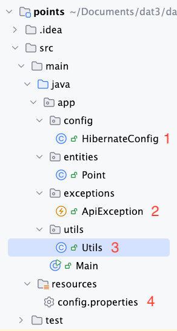

# JPA-Maven Setup in IntelliJ

## Technologies

- Maven
- Java 17
- JPA
- Hibernate
- PostgresSQL

## How-to

1. Open IntelliJ and create a new project.
2. Select Maven and Java 17 or higher.
3. In advanced settings, add groupId.
4. Click finish.

    

5. Open the `pom.xml` file and add the following dependencies:

    ```xml
    <dependencies>
        
        <!--  DB    -->
        <dependency>
            <groupId>org.postgresql</groupId>
            <artifactId>postgresql</artifactId>
            <version>${postgres.version}</version>
        </dependency>
        <dependency>
            <groupId>org.hibernate.orm</groupId>
            <artifactId>hibernate-core</artifactId>
            <version>${hibernate-version}</version>
        </dependency>
        
        <!--  LOMBOK    -->
        <dependency>
            <groupId>org.projectlombok</groupId>
            <artifactId>lombok</artifactId>
            <version>${lombok.version}</version>
            <scope>provided</scope>
        </dependency>
        
        <!--  TESTING      -->
        <dependency>
            <groupId>org.junit.jupiter</groupId>
            <artifactId>junit-jupiter-api</artifactId>
            <version>${junit.version}</version>
            <scope>test</scope>
        </dependency>
        <dependency>
            <groupId>org.junit.jupiter</groupId>
            <artifactId>junit-jupiter-engine</artifactId>
            <version>${junit.version}</version>
            <scope>test</scope>
        </dependency>
        <dependency>
            <groupId>org.junit.jupiter</groupId>
            <artifactId>junit-jupiter-params</artifactId>
            <version>${junit.version}</version>
            <scope>test</scope>
        </dependency>
    </dependencies>
    ```

6. Add the following lines into the properties tag

    ```xml
    <lombok.version>1.18.36</lombok.version>
    <hibernate-version>6.6.6.Final</hibernate-version>
    <junit.version>5.11.4</junit.version>
    <postgres.version>42.7.5</postgres.version>
    ```

7. Create a new java class file called `HibernateConfig` (1).

    

8. Copy and paste the following [Link](https://gist.github.com/jonbertelsen/3010e760d3c8a35d5b71ef1bcd264401) into the `HibernateConfig.class`

9. The `HibernateConfig.class` uses a few methods and classes that are not yet created. You will need to create these classes and methods yourself. Check illustration above to see reference and project structure - and grab the code below:

    (2) Add the package `exceptions` and add this custom exception class:

    ```java
    package app.exceptions;

    public class ApiException extends RuntimeException {
        private int code;

        public ApiException(int code, String msg){
            super(msg);
            this.code = code;
        }
        public int getCode(){
            return code;
        }
    }
    ```

    (3) Add the package `util` and add this class:

    ```java
    package app.utils;

    import app.exceptions.ApiException;

    import java.io.IOException;
    import java.io.InputStream;
    import java.util.Properties;

    public class Utils {

        public static String getPropertyValue(String propName, String resourceName)  {
            try (InputStream is = Utils.class.getClassLoader().getResourceAsStream(resourceName)) {
                Properties prop = new Properties();
                prop.load(is);

                String value = prop.getProperty(propName);
                if (value != null) {
                    return value.trim();  // Trim whitespace
                } else {
                    throw new ApiException(500, String.format("Property %s not found in %s", propName, resourceName));
                }
            } catch (IOException ex) {
                throw new ApiException(500, String.format("Could not read property %s.", propName));
            }
        }
    }
    ```

    (4) In the `resource` folder, add a configuration called: `config.properties':

    ```plaintext
    DB_NAME=name_of_your_db
    DB_USERNAME=postgres
    DB_PASSWORD=postgres
    ```

10. Add a proper .gitignore file:

    - [https://gist.github.com/jonbertelsen/48bfceee0efa71eacc2c87773aa0d4d7](https://gist.github.com/jonbertelsen/48bfceee0efa71eacc2c87773aa0d4d7)
