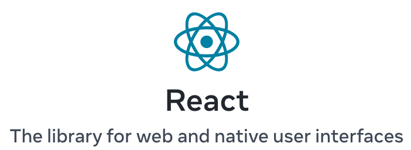

{: style="display: block; margin: 0 auto; width:50%" }

## 🧑‍🏫 Styling React Components with CSS Modules

## 🧩 What are CSS Modules?

A **CSS Module** is a CSS file in which all class and ID names are **scoped locally by default** to the component that imports them.

### 💡 Why use them?

In regular CSS:

* Styles are **global**.
* A `.button` in one file could **override** a `.button` in another.

With CSS Modules:

* Each class name is **locally scoped** to the component.
* React automatically **renames** the classes to avoid conflicts (e.g. `button_abc123`).
* You can **write regular CSS** — but with added safety and structure.

---

## ✅ Pros and ❌ Cons

| Pros                                   | Cons                                |
| -------------------------------------- | ----------------------------------- |
| No name collisions                     | Slightly more setup                 |
| Fully compatible with regular CSS      | You have to remember to `import`    |
| Easy to use, especially in small teams | Not as dynamic as styled-components |
| Great with TypeScript + IDEs           | No media query composition          |

---

## 🚀 How to Use CSS Modules in React

### 🧱 1. Project structure

```bash
src/
├── App.jsx
├── App.module.css
```

### 📄 2. `App.module.css` — This is the CSS Module

```css
/* App.module.css */
.container {
  padding: 2rem;
  background-color: #f0f0f0;
  text-align: center;
  border-radius: 8px;
}

.title {
  color: #333;
  font-size: 1.8rem;
}

.button {
  padding: 0.5rem 1rem;
  border: none;
  background-color: teal;
  color: white;
  border-radius: 5px;
  cursor: pointer;
}
```

### ⚛️ 3. `App.jsx` — This is the React component

```jsx
import styles from './App.module.css';

export default function App() {
  return (
    <div className={styles.container}>
      <h1 className={styles.title}>Welcome to CSS Modules</h1>
      <button className={styles.button}>Click me</button>
    </div>
  );
}
```

> Note: `styles.container` uses the class from `App.module.css`, but it’s **automatically scoped** to this component.

---

## 🧪 Try It Yourself

### 1. Start a new Vite or Create React App project

```bash
npm create vite@latest css-modules-demo --template react
cd css-modules-demo
npm install
npm run dev
```

### 2. Add the `.module.css` file next to any component and start using scoped styles

---

## 💡 Bonus Tips

* You can **combine multiple classes**:

  ```jsx
  className={`${styles.button} ${styles.danger}`}
  ```

* You can still use **global styles** (like `index.css`) for base layout and reset rules.

---

## 🧠 Summary

| Feature    | CSS Modules                           |
| ---------- | ------------------------------------- |
| Syntax     | Regular CSS                           |
| Scope      | Local to the importing component      |
| Use case   | Medium-sized React apps               |
| How to use | `import styles from './X.module.css'` |
