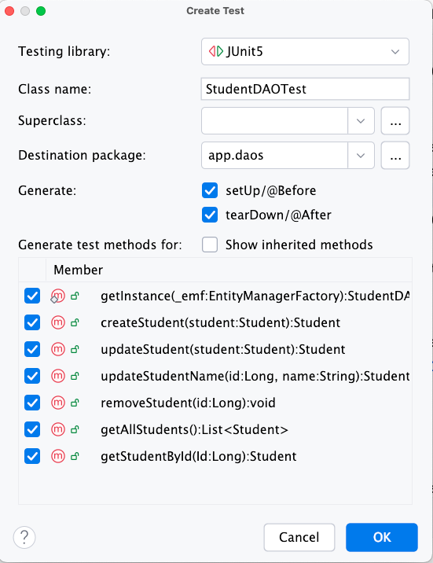
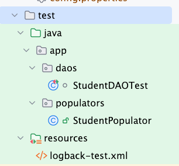

# DAO Integration Test with test containers

Use this [demo code as a guideline](https://github.com/jonbertelsen/codelab_1_3sem_spring2025/tree/integrationtest) for how to setup DAO integration tests with test containers. Notice that the integration test is in the "integrationtest" branch of the repository. If you wish to follow this tutorial, then clone the main branch and go from there.

The project is setup in accordance with the [JPA setup guidelines](../java/orm/jpa_setup.md) and the example is based on this [JPA CodeLab exercise](../../jpa_part1/exercises/codelab.md).

## Video tutorial

You are welcome to follow this guided video tutorial - which contains a run-through of what comes below:

- [Integration Test of your DAO methods](https://cphbusiness.cloud.panopto.eu/Panopto/Pages/Viewer.aspx?id=5129a2f6-b744-4441-a7fc-b27d00b314ae)

## 1. Update your `pom.xml` file

The integration tests relies on a number of dependencies:

- JUnit 5 (org.junit.jupiter)
- Hamcrest (org.hamcrest)
- Testcontainers (org.testcontainers)
- Logging (ch.qos.logback and org.slf4j)

Copy the dependencies from [this version of the pom.xml](https://github.com/jonbertelsen/codelab_1_3sem_spring2025/blob/integrationtest/pom.xml).
Remember to also get the version properties:

```xml
<testcontainers.version>1.20.4</testcontainers.version>
<logback-classic>1.5.16</logback-classic>
<org.slf4j>2.0.16</org.slf4j>
<hamcrest>3.0</hamcrest>
```

Newer versions might be available at Maven Central. Check them out, but make sure the versions you pick are stable.

## 2. Setup a `StudentDAOTest` class skeleton

The easiest way to do this in IntelliJ is to choose "**Generate...**" in the DAO class - and then choose "**Test...**".



## 3. Add class variables

- EntityManagerFactory
- StudentDAO
- Testdata (s1 and s2)

Example:

```java
private static final EntityManagerFactory emf = HibernateConfig.getEntityManagerFactoryForTest();
private static final StudentDAO studentDAO = StudentDAO.getInstance(emf);
private static Student s1;
private static Student s2;
```

## 4. Setup @BeforeEach

- This method is executed before each individual unit test.
- So delete all tables
- Reset autogenerated primary keys
- Populate the tables with known data

This is an example:

```java
@BeforeEach
    void setUp() {
        try (EntityManager em = emf.createEntityManager()) {
            em.getTransaction().begin();
                em.createQuery("DELETE FROM Student").executeUpdate();
                em.createNativeQuery("ALTER SEQUENCE student_id_seq RESTART WITH 1");
            em.getTransaction().commit();
            Student[] students = StudentPopulator.populate(studentDAO);
            s1 = students[0];
            s2 = students[1];
        } catch (Exception e){
            e.printStackTrace();
        }
    }
```

## 5. Setup a populator class

This trick here is to be able to get a handle on the entities you persist. One way is to store the entities after persisting them into an array,
and then return the array to the test class. By having references to the entities in the test database, you can easily pick out the ids.

In this example, we will declare two variables in the test class:

```java
private static Student s1;
private static Student s2;
```

In the @BeforeEach section, we will call a populator method that return an array of entities and then assign the `s1` and `s2` to the persisted test entities:

```java
Student[] students = StudentPopulator.populate(studentDAO);
s1 = students[0];
s2 = students[1];
```

## 6. Fix up the `HibernateConfig` file

Make sure the `HibernateConfig` file is updated with right test properties:

```java
private static Properties setTestProperties(Properties props) {
   props.put("hibernate.connection.driver_class", "org.testcontainers.jdbc.ContainerDatabaseDriver");
   props.put("hibernate.connection.url", "jdbc:tc:postgresql:16.2:///test_db");
   props.put("hibernate.archive.autodetection", "hbm,class");
   props.put("hibernate.show_sql", "false");
   props.put("hibernate.hbm2ddl.auto", "create-drop");
   return props;
}
   ```

## 7. Add a logger to limit the log output

- You don't need this step, but spinning up the test container generates a lot of verbose log info by default. If you configure a logger, you can limit the noise:

- Create a `resource` folder in the test folder. This is how the folders can be structured:
   
- Add a file called **"logback-test.xml"** with the content:

   ```xml
   <configuration>
      <!-- Suppress debug logs from Testcontainers -->
      <logger name="org.testcontainers" level="INFO"/>
      <logger name="org.testcontainers.utility" level="WARN"/>
      <logger name="docker" level="WARN"/>

      <!-- Optional: Reduce Hibernate verbosity -->
      <logger name="org.hibernate.SQL" level="WARN"/>
      <logger name="org.hibernate.type.descriptor.sql.BasicBinder" level="WARN"/>
      <logger name="org.hibernate.engine.jdbc.batch.internal.BatchingBatch" level="ERROR"/>

      <!-- Console Appender -->
      <appender name="STDOUT" class="ch.qos.logback.core.ConsoleAppender">
         <encoder>
               <pattern>%d{yyyy-MM-dd HH:mm:ss} [%level] %logger{36} - %msg%n</pattern>
         </encoder>
      </appender>

      <root level="INFO">
         <appender-ref ref="STDOUT"/>
      </root>
   </configuration>
   ```

## 8. Create your tests one by one

Craft your tests of each DAO method, one by one. Make sure that you cover most cases:

1. First test that the number of rows in the tables match
2. Secondly, make sure that the entities are the right ones, and that the attributes have the expected content. You might need to create `equals` and `hashcode` methods on the entities to help the junit / [hamcrest matchers](./hamcrest.md) to work correctly. Hamcrest offers the matcher `samePropertyValuesAs` that can help you getting the job done like this:

   ```java
   assertThat(s1ToUpdate, samePropertyValuesAs(s1));
   ```
